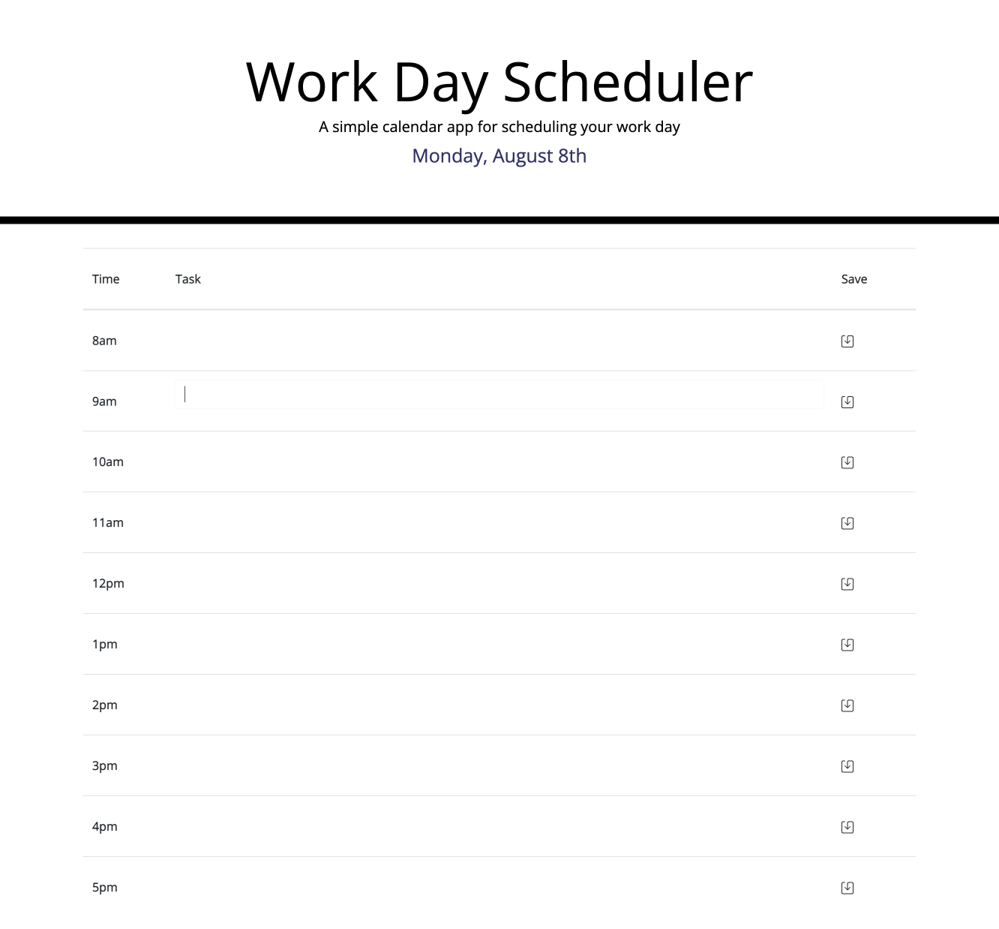

# plan-your-day
## Description
The goal of this challenge is to create a dynamic work-day calendar that allows users to track tasks/events and store them locally on their device. 

Work in progress. 

## Acceptance Criteria
1. When the planner is opened, the current day is displayed at the top of the screen.
2. When the user scrolls down, there are time blocks displaying standard business hours.
3. Each time block is color-coded to indicate whether the event is in a past, present, or future hour.
4. When the user clicks on a time block, they are able to edit that event.
5. When the user clicks the save button, the event they input is saved into their local storage.
6. When the user refreshes the page, any saved events are still there.

## Screenshot of page
 

## Deployed Application
Click [here](https://indigofobes.github.io/plan-your-day/develop/) for live URL.

Click [here](https://github.com/IndigoFobes/plan-your-day.git) for my GitHub repository.
